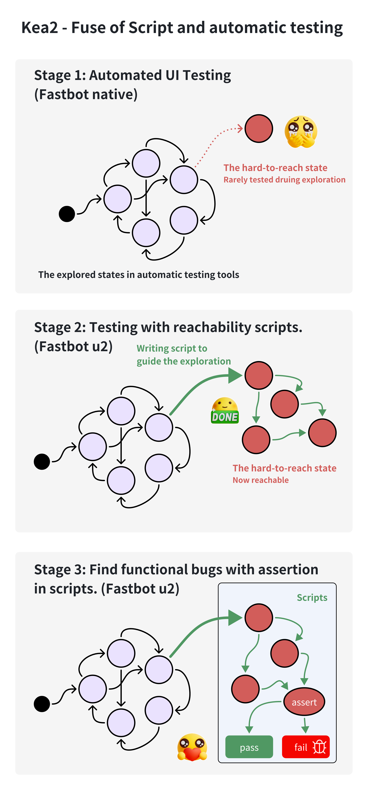

## Intro 

Kea2 is an easy-to-use Python library for supporting and customizing automated UI testing for mobile apps. The library is currently built on top of [Fastbot](https://github.com/bytedance/Fastbot_Android) and [uiautomator2](https://github.com/openatx/uiautomator2), and targeting [Android](https://en.wikipedia.org/wiki/Android_(operating_system)) apps.

It has these important features:
- **Stage 1**: coming with the full capability of [Fastbot](https://github.com/bytedance/Fastbot_Android) for finding *stability problems* (i.e., *crashing bugs*); 
- **Stage 2**: customizing specific testing scenarios (自定义测试场景或事件序列[^1], e.g., testing specific app functionalities, executing specific event traces, entering specifc UI pages, reaching specific app states) with the full capability and flexibility powered by *python* language and [uiautomator2](https://github.com/openatx/uiautomator2);
- **Stage 3**: supporting auto-assertions (断言机制[^2]) during automated GUI testing, based on the idea of [property-based testing](https://en.wikipedia.org/wiki/Software_testing#Property_testing) inheritted from [Kea](https://github.com/ecnusse/Kea), for finding *logic bugs* (i.e., *non-crashing bugs*)


<div align="center">
    <a name="kea2"></a>
    
</div>


> In essence, Kea2 is designed to be capable of fusing the (property-based) *scripted tests* (e.g., written in uiautomator2) with automated UI testing tools (e.g., Fastbot), thus combining the strengths of human knowledge on app's business logics (empowered by the scripted tests) and random fuzzing. Many useful features (e.g., mimicing exploratory testing) can be implemented based on such a capability.
 
Kea2, released as a Python library, currently works with:
- [unittest](https://docs.python.org/3/library/unittest.html) as the testing framework;
- [uiautomator2](https://github.com/openatx/uiautomator2) as the UI test driver; 
- [Fastbot](https://github.com/bytedance/Fastbot_Android) as the backend automated GUI testing tool.

In the future, Kea2 is planned to additionally support
- [pytest](https://docs.pytest.org/en/stable/)
- [Appium](https://github.com/appium/appium), [Hypium]() (for HarmonyOS)
- other automated UI testing tools (not limited to Fastbot)

> Kea2 is inspired by many valuable insights, advices and lessons shared by experienced industrial practitioners. Kudos!

## Installation

Running requirements or environment:
- support Windows, MacOS and Linux
- python 3.8+
- Android SDK installed
- **VPN disabled** (u2 mode requires local network access. VPN will lead to error)

1. Create a workspace and clone this repository into the workspace.

```bash
git clone git@github.com:ecnusse/Kea2.git
cd Kea2
```

2. Setup python envirnment with uv
```bash
pip install --upgrade pip
pip install uv
uv sync
```

> [uv](https://docs.astral.sh/uv/) is a python package manager.

## Quick Start

1. Create and start an Android emulator (e.g., Android 12 -- API version 31).

```bash
sdkmanager "system-images;android-31;google_apis;x86_64"
avdmanager create avd --force --name Android12 --package 'system-images;android-31;google_apis;x86_64' --abi google_apis/x86_64 --sdcard 1024M --device 'Nexus 7'
emulator -avd Android12 -port 5554 &
```

or, prepare one real Android device (not two) with `Developer Options` enabled, connect this device to your machine, and make sure you can see the connected device by running `adb devices`.

2. run `quickstart.py` to fuzz a sample app `omninotes`.
The script will automatically download the sample app `omninotes`'s apk `omninotes.apk` and run.

```python
uv run quickstart.py
```

> [quickstart.py](https://github.com/XixianLiang/KeaPlus/blob/main/quickstart.py) gives a dead simple scripted test which is ready-to-go with Fastbot. You can customize this script test for testing your apps at your needs.

## How to understand Kea2?

[As shown in the introduction part](#Intro), We have 3 stages in Kea2.

### Stage 1: Automated UI Testing

During automated UI testing. We can find crashed bugs with automated UI testing tools such as [fastbot](https://github.com/bytedance/Fastbot_Android), [monkey](https://developer.android.com/studio/test/other-testing-tools/monkey), [AppCrawler](https://github.com/seveniruby/AppCrawler).
But we have some states that's hard to reach for testing tools because these states requires human knowledge.


**How to use stage 1**

Most of the command is similar to [Fastbot](https://github.com/bytedance/Fastbot_Android?tab=readme-ov-file#run-fastbot-with-shell-command)

Here's a sample shell command. See more options with `python kea_launcher.py driver -h`
```bash
python3 kea_launcher.py driver --agent native --running-minutes 10 -p it.feio.android.omninotes.alpha -s emulator-5554
```

### Stage 2: Automated UI Testing with rechability scripts

As described in stage 1, we have some hard-to-reach states because the path to these states require human knowledge.

Here's some examples:
- **The action requires human knowledge:** Filling a form
- **The state is too deep:** Entering the target state requires multiple steps and complicated conditions.

However, this is the strength of script testing. By writing scripts. We can guide the testing tool to wherever we want.


**How to use stage 2**

In high level, A script in UI automated testing is composed by 2 parts.

1. **Precondition:** When to execute the script.
2. **Script body:** The interaction logic to reach where we want.

Here's an example. Given the `Privacy Settings` is a hard-to-reach page, we can guide the automated testing tool to this page when we are at `Home` page.

In precondition, we specify when do we want to execute this script. 
In this case, we want to execute the script when we are at `Home` page. The way we specify `Home` is the widget `Home` exists.

In script body, we write the interaction logic to guide the tools to Privacy page. (Same as scipt testing)

```python
    # Precond: When we are at home page
    @precondition(lambda self: 
        self.d(text="Home").exists
    )
    def test_goToPrivacy(self):
        """
        Guide automated testing tool to Privacy Settings.
        """
        self.d(description="Drawer").click()
        self.d(text="Settings").click()
        self.d(text="Privacy").click()
```

In practice, we support the python internal test framework [unittest](https://github.com/python/cpython/tree/main/Lib/unittest) and app driver [uiautomator2](https://github.com/openatx/uiautomator2).

You can write your own script in [unittest's TestCase](https://docs.python.org/3/library/unittest.html#unittest.TestCase).

```python
# my_first_property.py
import unittest
from kea.keaUtils import precondition

class MyTest(unittest.TestCase):
    # [Attention] Only the test method decorated with precond will be loaded as a property script
    # [Attention] Only the method starts with "test_" will be found by unittest
    @precondition(lambda self: ...)
    def test_func1(self):...
```

Here's a sample command for stage 2. Additionally, We need to specify 2 parts.
1. `--driver-name` : The driver name we defined in script. Like `self.d(text="Home").click()`, the driver is self.d. So we need to specify  `--driver-name d`.
2. `unittest ...` : The sub-commands following `unittest`. Specifying where to load the scripts. It is compatible with unittest framework. Which can be found in `python3 -m unittest -h`.

```bash
python3 kea_launcher.py driver --agent u2 --running-minutes 10 -p it.feio.android.omninotes.alpha -s emulator-5554 --driver-name d unittest my_first_property.py
```

**What we can do in stage2?**

With the use of script, we can, but not limit to, compliting the following tasks.
- **Take actions that require human knowledge**
- **Entering a hard-to-reach state**
- **Cooperate with other apps (share, payment...)**
- **Guide the testing tool to a particular scenario to do stress test**
- More to explore...

### Stage 3: Find functional bugs with assertions in scripts.

In fact. We can do more when we have scripts. Previously, we find crashed bugs with automated testing tool like fastbot. And find functional bugs in scipt testing with the use of assertion.

**The reason why automated testing tool cannot find functional bug is the lack of test oracle.** The tool can only specify a crash bug (the bug appears when app crash), but is not able to specify a funcitonal bug. 

Howerver, in script testing. We make use of human knowledge to specify functional bugs' test oracle. We did it by **making assertion** in script. When assertion fails, we find a suspected bug.

Apparently, we can make assertion in stage 2's scripts. And here comes stage 3: Find functional bugs with assertions in scripts.


**How to use stage 3**

We make assrtions to make full use of the capability of script and find functional bug. Compare to stage 2. We need to make assertion when we finish the script body. (Of course we can make multiple assertions just like what we do in script testing)

1. **Precondition:** When to execute the script.
2. **Script body:** The interaction logic to reach where we want.
3. **Assertion:** The expected app behaviour.

Here's an statement example. In social app, the `send button` should exists when the input box is not empty.

<div align="center">
    <div style="width:70%;">
        
    </div>
    <p>An inputbox bug<p/>
    <p>Expected (Upper.) Bug (Lower.)<p/>
</div>

So, we can write the following script to check this bug. When the `input_box` is not empty. We assert the send_button exists.

```python
    @precondition(
        lambda self: len(self.d(description="input_box").text) > 0
    )
    def test_input_box(self):
        assert self.d(description="send_button").exist
```

We call these scripts **property** and The stage 3 method **Property based testing (PBT)**. You can learn more about this technique [here](https://github.com/ecnusse/Kea).


## Shell command and script command.

Just like unittest, we have 2 ways to launch Kea2.

### 1. Shell command

Kea is compatible with `unittest` framework. You can manage your test cases in unittest style.

To do so, launch Kea2 with `kea_launcher.py`. And set the args in `unittest` sub-commands.

You will have the following two sub-commands.

- **driver** : Settings of kea options.
- **unittest** : Settings of unittest.

Launch kea with 
```
python3 kea_launcher.py driver <fastbot cmds> unittest <unittest cmds> 
```

Sample commands:

```bash
# Launch fastbot with command followed by driver (Same in `options`). Load the properties (testCases) from directory mytests/omni_notes
python3 kea_launcher.py driver -s "emulator-5554" -p it.feio.android.omninotes.alpha --agent u2 --running-minutes 10 --throttle 200 --driver-name d unittest discover -s mytests/omni_notes

# Launch fastbot and load properties from quickstart2.py.
python3 kea_launcher.py driver <...> unittest quickstart2.py
```

> Hint: All commands in unittest is compatible in kea_launcher's sub-commands. See `python3 -m unittest -h` for details.


### 2. unittest.main in script
Just like unittest. We can launch the test through the method `unittest.main`.

Here's how we do so.

```python
import unittest

from kea2 import KeaTestRunner, Options
from kea2.u2Driver import U2Driver

class YourTest(unittest.TestCase):
    ...
    # <your script here>

if __name__ == "__main__":
    KeaTestRunner.setOptions(
        Options(
            driverName="d",
            Driver=U2Driver,
            packageNames=[PACKAGE_NAME],
            # serial="emulator-5554",   # specify the serial
            maxStep=100,
            # running_mins=10,  # specify the maximal running time in minutes, default value is 10m
            # throttle=200,   # specify the throttle in milliseconds, default value is 200ms
            # agent='native'  # 'native' for running the vanilla Fastbot
        )
    )
    # Declare the KeaTestRunner
    unittest.main(testRunner=KeaTestRunner)
```

Here's all the available options in `Options`.

```python
# the driver_name in script (if self.d, then d.) 
driverName: str
# the driver (only U2Driver available now)
Driver: U2Driver
# list of package names. Specify the apps under test
packageNames: List[str]
# target device
serial: str = None
# test agent. "native" for stage 1 and "u2" for stage 1~3
agent: "u2" | "native" = "u2"
# max step in exploration (availble in stage 2~3)
maxStep: int # default "inf"
# time(mins) for exploration
running_mins: int = 10
# time(ms) to wait when exploring the app
throttle: int = 200
```

## Quick Report on script execution statistics.

Now we have a quick report on property execution statistics. If you want to know whether your script is executed during testing. Open the `result.json` file.

Here's an example.

```json
{
    "test_goToPrivacy": {
        "precond_satisfied": 8,
        "executed": 2,
        "fail": 0,
        "error": 1
    },
    ...
}
```

**How to read `result.json`**

Item | Description | Meaning
--- | --- | --- |
precond_satisfied | During exploration, how many times does the script satisfy it's precond? (executable) | Dose we reach the state during exploration? 
executed | During exploration, how many times the script is executed? | Has the script been used?
fail | (PBT) How many times dose the script failed the assertion during execution? (When you have assertion in your script) | When failed, the script found an suspected error. (Assertion clause is the expected behaviour)
error | How many times dose the script abort during excution due to error (e.g. UI not found.) | When error, the script needs to be fix (script leads to an unexpected state.)

### Write your own script

Script is for customizing specific testing scenarios (rechability) and auto-assertions (find functional bugs). In the high level, scripts in Kea2 is highly similar to the testing scripts in smoke and regression test.

Here, we need to focus.

You can read [Kea - Write your fisrt property](https://kea-docs.readthedocs.io/en/latest/part-keaUserManuel/first_property.html) for more details.


## Contributors/Maintainers

Kea2 has been actively developed and maintained by the people in [ecnusse](https://github.com/ecnusse).

### Open-source projects used by Kea2

- [Fastbot](https://github.com/bytedance/Fastbot_Android)
- [uiautomator2](https://github.com/openatx/uiautomator2)
- [hypothesis](https://github.com/HypothesisWorks/hypothesis)

[^1]: 不少UI自动化测试工具提供了“自定义事件序列”能力（如[Fastbot](https://github.com/bytedance/Fastbot_Android/blob/main/handbook-cn.md#%E8%87%AA%E5%AE%9A%E4%B9%89%E4%BA%8B%E4%BB%B6%E5%BA%8F%E5%88%97) 和[AppCrawler](https://github.com/seveniruby/AppCrawler)），但在实际使用中存在不少问题，如自定义能力有限、使用不灵活等。此前不少Fastbot用户抱怨过其“自定义事件序列”在使用中的问题，如[#209](https://github.com/bytedance/Fastbot_Android/issues/209), [#225](https://github.com/bytedance/Fastbot_Android/issues/225), [#286](https://github.com/bytedance/Fastbot_Android/issues/286)等。

[^2]: 在UI自动化测试过程中支持自动断言是一个很重要的能力，但几乎没有测试工具提供这样的能力。我们注意到[AppCrawler](https://ceshiren.com/t/topic/15801/5)的开发者曾经希望提供一种断言机制，得到了用户的热切响应，不少用户从21年就开始催更，但始终未能实现。