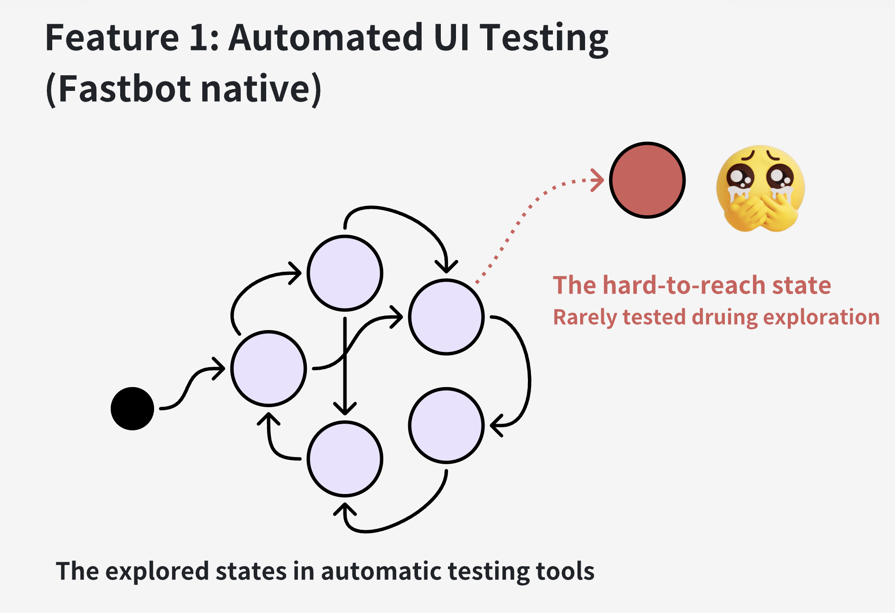
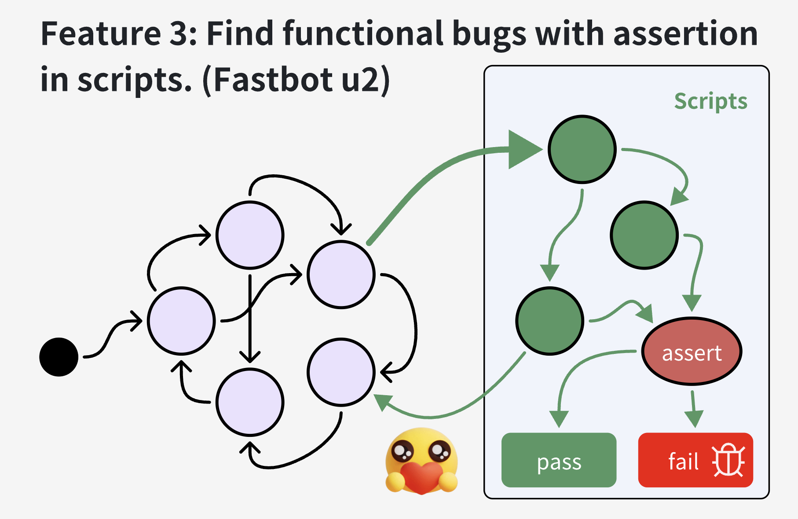

# Introduction 

Kea2 is an easy-to-use Python library for supporting and customizing automated UI testing for mobile apps. The library is currently built on top of [Fastbot](https://github.com/bytedance/Fastbot_Android) and [uiautomator2](https://github.com/openatx/uiautomator2), and targeting [Android](https://en.wikipedia.org/wiki/Android_(operating_system)) apps.

### Kea2 has three important features:
- **Feature 1**: coming with the full capability of [Fastbot](https://github.com/bytedance/Fastbot_Android) for stress testing and finding *stability problems* (发现稳定性问题) (i.e., *crashing bugs*); 
- **Feature 2**: customizing testing scenarios (自定义测试场景或事件序列[^1], e.g., testing specific app functionalities, executing specific event traces, entering specifc UI pages, reaching specific app states) with the full capability and flexibility powered by *python* language and [uiautomator2](https://github.com/openatx/uiautomator2);
- **Feature 3**: supporting auto-assertions (支持断言机制[^2]) during automated UI testing, based on the idea of [property-based testing](https://en.wikipedia.org/wiki/Software_testing#Property_testing) inheritted from [Kea](https://github.com/ecnusse/Kea), for finding *logic bugs* (i.e., *non-crashing bugs*)

These three features can be combined to customize and improve automated UI testing.

<div align="center">
    <div style="max-width:80%; max-height:80%">
     
    </div>
</div>

> Kea2 is designed to be capable of fusing the (property-based) *scripted tests* (e.g., written in uiautomator2) with automated UI testing tools (e.g., Fastbot), thus combining the strengths of human knowledge on app's business logics (empowered by the scripted tests) and random fuzzing. Many useful features (e.g., mimicing exploratory testing) can be implemented based on such a capability.

**The ability of the three features in Kea2**
|  | **Feature 1** | **Feature 2** | **Feature 3** |
| --- | --- | --- | ---- |
| **Finding crashes** | :+1: | :+1: | :+1: |
| **Finding crashes in deep states** |  | :+1: | :+1: |
| **Finding non-crashing functional bugs** |  |  | :+1: |
 
Kea2, released as a Python library, currently works with:
- [unittest](https://docs.python.org/3/library/unittest.html) as the testing framework;
- [uiautomator2](https://github.com/openatx/uiautomator2) as the UI test driver; 
- [Fastbot](https://github.com/bytedance/Fastbot_Android) as the backend automated UI testing tool.

In the future, Kea2 will be extended to support
- [pytest](https://docs.pytest.org/en/stable/)
- [Appium](https://github.com/appium/appium), [Hypium]() (for HarmonyOS)
- other automated UI testing tools (not limited to Fastbot)

> Kea2 is inspired by many valuable insights, advices and lessons shared by experienced industrial practitioners. Kudos!


# Deploy Kea2

## Installation

Running requirements/environment:
- support Windows, MacOS and Linux
- python 3.8+
- Android SDK installed
- **VPN closed** (Features 2 and 3 required)

1. Clone `Kea2` into your workspace.

```bash
git clone git@github.com:ecnusse/Kea2.git
cd Kea2
```

2. Setup the python virtual environment with `uv`.

> [uv](https://github.com/astral-sh/uv) is a extremely fast python package and project manager. It creates a python virtual environment like `virtualenv` to avoid any dependency issues or conflicts with your existing python environment.
Of course, you can also setup Kea2 in your [global environment](#appendix-install-kea-to-global-environment).

```bash
pip install --upgrade pip
pip install uv
uv sync
```

> MacOS users may have trouble with global pip install. In such cases, they can use `brew`.
```bash
# For macOS users
brew install uv
uv sync
```

3. Activate virtual environment

- Linux and macOS
```bash
source .venv/bin/activate
```

- Windows cmd
```cmd
\.venv\Scripts\activate.bat
```

- Windows powershell
```powershell
\.venv\Scripts\activate.ps1
```

## Quick Test

Kea2 connects to and runs on Android devices. We recommend you to do a quick test to ensure that Kea2 is compatible with your devices.

1. Connect to an Android device and make sure you can see the connected device by running `adb devices`. 

2. Run `quickstart.py` to test a sample app `omninotes` (released as `omninotes.apk` in Kea2's repository). The script `quickstart.py` will automatically install and test this sample app.

```python
python3 quickstart.py
```

If you can see the app `omninotes` is successfully running and tested, Kea2 works. Otherwise, please help file a bug report with the error message to us.

If you do not have an Android device at hand, you can use an Android emulator to run Kea2. The following commands can help create and start an Android emulator (Android version 12, API level 31) on a x86 machine (of course, you can create emulators by Android Studio):
```bash
sdkmanager "system-images;android-31;google_apis;x86_64"

avdmanager create avd --force --name Android12 --package 'system-images;android-31;google_apis;x86_64' --abi google_apis/x86_64 --sdcard 1024M --device 'Nexus 7'

emulator -avd Android12 -port 5554 &
```

> [quickstart.py](https://github.com/XixianLiang/KeaPlus/blob/main/quickstart.py) gives a dead simple scripted test which is ready-to-go with Fastbot. You can customize this script test for testing your apps at your needs.

## Feature 1: running Fastbot to automate UI Testing

Test your app with the full capability of [Fastbot](https://github.com/bytedance/Fastbot_Android) for stress testing and finding *stability problems* (发现稳定性问题) (i.e., *crashing bugs*); 


```bash
python3 kea_launcher.py driver --agent native --running-minutes 10 -p it.feio.android.omninotes.alpha -s emulator-5554
```

The usage is similar to the the original [Fastbot](https://github.com/bytedance/Fastbot_Android?tab=readme-ov-file#run-fastbot-with-shell-command). 
See more options by `python kea_launcher.py driver -h`


## Feature 2: customizing automated UI testing by scripts

When running any automated UI testing tools like Fastbot to test your apps, you may find that some specifc UI pages or functionalities are difficult to reach or cover. The reason is that Fastbot lacks knowledge of your apps. 

<div align="center">
    <div>
     
    </div>
</div>

However, this is the strength of script testing. In Feature 2, Kea2 can support writing small scripts to guide Fastbot to explore wherever we want.

<div align="center">
     
</div>

In Kea2, you can test your app by customizing testing scenarios (自定义测试场景或事件序列[^1], e.g., testing specific app functionalities, executing specific event traces, entering specifc UI pages, reaching specific app states) with the full capability and flexibility powered by `python` language and [uiautomator2](https://github.com/openatx/uiautomator2);

In Kea2, a script is composed of two elements:
-  **Precondition:** When to execute the script.
- **Script body:** The interaction logic to reach where we want.

### Example

Assuming `Privacy` is a hard-to-reach page, we can guide Fastbot to reach this page when we are at the `Home` page.

```python
    @prob(0.5)
    # precondition: when we are at the page `Home`
    @precondition(lambda self: 
        self.d(text="Home").exists
    )
    def test_goToPrivacy(self):
        """
        Guide Fastbot to the page `Privacy` by opening `Drawer`, 
        clicking the option `Setting` and clicking `Privacy`.
        """
        self.d(description="Drawer").click()
        self.d(text="Settings").click()
        self.d(text="Privacy").click()
```

- By the decorator `@precondition`, we specify the precondition --- when we are at the `Home` page. In this case, the script will be invoked when we are at `Home` page by checking whether the widget `Home` exists.
- In script body of function `test_goToPrivacy`, we specify the interaction logic (i.e., opening `Drawer`, clicking the option `Setting` and clicking `Privacy`) to guide Fastbot to reach the page `Privacy`.
- By the decorator `@prob`, we specify the probability (50% in this example) to do the guidance when we are at the `Home` page. 

You can find the full example in script `quickstart2.py` and run it by executing:
```python
python3 quickstart2.py
```

## Feature 3: Finding functional bugs by adding assertions in scripts.

Kea2 supports auto-assertions (支持断言机制[^2]) during automated UI testing for finding *logic bugs* (i.e., *non-crashing bugs*). To achieve this, you can add assertions in the scripts. When an assertion fails during automated UI testing, we find a likely functional bug. This idea is inspired by  [property-based testing](https://en.wikipedia.org/wiki/Software_testing#Property_testing) inheritted from [Kea](https://github.com/ecnusse/Kea).

<div align="center">
     
</div>

In Feature 3, a script is composed of three elements:

1. **Precondition:** When to execute the script.
2. **Script body:** The interaction logic to reach where we want.
3. **Assertion:** The expected app behaviour.

### Example

In a social media app like WeChat, on the message sending page, the `send` button should always exists when the input box is not empty.

<div align="center" >
    <div >
        
    </div>
    <p>The expected behavior (the upper figure) and the buggy behavior (the lower figure).
<p/>
</div>

For the preceding always-holding property, we can write the following script to validate the functional correctness: when there is an `input_box` widget on the message sending page, we can type any non-empty string text into the input box and assert `send_button` should always exists.


```python
    @precondition(
        lambda self: self.d(description="input_box").exists
    )
    def test_input_box(self):
        from hypothesis.strategies import text, ascii_letters
        random_str = text(alphabet=ascii_letters).example()
        self.d(description="input_box").set_text(random_str)
        assert self.d(description="send_button").exist

        # we can even do more assertions, e.g.,
        #       the input string should exist on the message sending page
        assert self.d(text=random_str).exist
```
> [hypothesis](https://github.com/HypothesisWorks/hypothesis) is a property-based testing library for Python. We use it to generate random texts according to the given rules.

# Documentation

## Write scripts

Kea2 uses [Unittest](https://github.com/python/cpython/tree/main/Lib/unittest) to manage scripts. All the Kea2's scripts can be found in unittest's rules (i.e., the test methods should start with `test_`, the test classes should extend `unittest.TestCase`).

Kea2 uses [Uiautomator2](https://github.com/openatx/uiautomator2) to manipulate android devices. Refer to [Uiautomator2's docs](https://github.com/openatx/uiautomator2?tab=readme-ov-file#quick-start) for more details.

Basically, you can write Kea2's scripts by following two steps:

1. Create a test class which extends `unittest.TestCase`.

```python
import unittest

class MyFirstTest(unittest.TestCase):
    ...
```

2. Write your own script by defining test methods

By default, only the test method starts with `test_` will be found by unittest. You can decorate the function with `@precondition`. The decorator `@precondition` takes a function which returns boolean as an arugment. When the function returns `True`, the precondition is satisified and the script will be enabled, and Kea2 will run the script based on certain probability defined by the decorator `@prob`.

Note that if a test method is not decorated with `@precondition`.
This test method will not never be activated during automated UI testing.
Thus, you need to explicitly specify `@precondition(True)` when the test method should be always executed. When a test method is not decorated with `@prob`, the default probability is 0.5. 

```python
import unittest
from kea2 import precondition

class MyFirstTest(unittest.TestCase):

    @prob(0.7)
    @precondition(lambda self: ...)
    def test_func1(self):
        ...
```

You can read [Kea - Write your fisrt property](https://kea-docs.readthedocs.io/en/latest/part-keaUserManuel/first_property.html) for more details.


## Launch Kea2

We offer two ways to launch Kea2.

### 1. Launch by shell commands

Kea is compatible with `unittest` framework. You can manage your test cases in unittest style. You can launch Kea2 with `kea_launcher.py` with two sub-commands `driver` (for Kea2 options) and `unittest` (for unittest options).

The shell command:
```
python3 kea_launcher.py driver <Kea2 cmds> unittest <unittest cmds> 
```

Sample shell commands:

```bash
# Launch Kea2 and load one single unittest script quickstart2.py.
python3 kea_launcher.py driver -s "emulator-5554" -p it.feio.android.omninotes.alpha --agent u2 --running-minutes 10 --throttle 200 --driver-name d unittest quickstart2.py

# Launch Kea2 and load multiple unittest scripts from the directory mytests/omni_notes
python3 kea_launcher.py driver -s "emulator-5554" -p it.feio.android.omninotes.alpha --agent u2 --running-minutes 10 --throttle 200 --driver-name d unittest discover -s mytests/omni_notes
```

| arg | meaning |
| --- | --- |
| -s | The serial of your device, which can be found by `adb devices` |
| -p | The tested app's package name (e.g., com.example.app) | 
| --agent |  {native,u2} Running native fastbot or u2-fastbot (only u2-fastbot supports scripts) |
| --running-minutes | Time to run Kea2 | 
| --max-step | maxium monkey events count to send (only available in `--agent u2`) | 
| --throttle | The pause (ms) between two monkey events |
| --driver-name | The name of driver used in the script. If `self.d(..).click()`, then `--driver-name d`. |
| unittest | Only available in `--agent u2`. Use to specify where to load the scripts. All commands in kea_launcher's unittest sub-commands is compatible with unittest. See `python3 -m unittest -h` for details.


### 2. Launch by `unittest.main`

Like unittest, we can launch Kea2 through the method `unittest.main`.

Here's how we do so.

```python
import unittest

from kea2 import KeaTestRunner, Options
from kea2.u2Driver import U2Driver

class MyTest(unittest.TestCase):
    ...
    # <your script here>

if __name__ == "__main__":
    KeaTestRunner.setOptions(
        Options(
            driverName="d",
            Driver=U2Driver,
            packageNames=[PACKAGE_NAME],
            # serial="emulator-5554",   # specify the serial
            maxStep=100,
            # running_mins=10,  # specify the maximal running time in minutes, default value is 10m
            # throttle=200,   # specify the throttle in milliseconds, default value is 200ms
            # agent='native'  # 'native' for running the vanilla Fastbot
        )
    )
    # Declare the KeaTestRunner
    unittest.main(testRunner=KeaTestRunner)
```

Here's all the available options in `Options`.

```python
# the driver_name in script (if self.d, then d.) 
driverName: str
# the driver (only U2Driver available now)
Driver: U2Driver
# list of package names. Specify the apps under test
packageNames: List[str]
# target device
serial: str = None
# test agent. "native" for stage 1 and "u2" for stage 1~3
agent: "u2" | "native" = "u2"
# max step in exploration (availble in stage 2~3)
maxStep: int # default "inf"
# time(mins) for exploration
running_mins: int = 10
# time(ms) to wait when exploring the app
throttle: int = 200
```

Then we can directly run the script file to launch Kea2, e.g.,
```python
python3 mytest.py
```

## Examining the running statistics of scripts .

If you want to examine whether your scripts have been executed or how many times they have been executed during testing. Open the file `result.json` after the testing is finished.

Here's an example.

```json
{
    "test_goToPrivacy": {
        "precond_satisfied": 8,
        "executed": 2,
        "fail": 0,
        "error": 1
    },
    ...
}
```

**How to read `result.json`**

Field | Description | Meaning
--- | --- | --- |
precond_satisfied | During exploration, how many times does the script satisfy it's precond? (executable) | Does we reach the state during exploration? 
executed | During exploration, how many times the script is executed? | Has the script been used?
fail | How many times does the script failed the assertions during UI testing? | When failed, the script found a likely functional bug. 
error | How many times does the script abort during UI tsting due to some unexpected errors (e.g. UI widgets cannot be found) | When error, the script needs to be fix because the script leads to some unexpected errors.

## Contributors/Maintainers

Kea2 has been actively developed and maintained by the people in [ecnusse](https://github.com/ecnusse).

### Appendix: Install Kea2 in a global environment

```bash
# In the Kea2 working directory
python3 -m pip install --upgrade pip
python3 -m pip install .
```

### Open-source projects used by Kea2

- [Fastbot](https://github.com/bytedance/Fastbot_Android)
- [uiautomator2](https://github.com/openatx/uiautomator2)
- [hypothesis](https://github.com/HypothesisWorks/hypothesis)

[^1]: 不少UI自动化测试工具提供了“自定义事件序列”能力（如[Fastbot](https://github.com/bytedance/Fastbot_Android/blob/main/handbook-cn.md#%E8%87%AA%E5%AE%9A%E4%B9%89%E4%BA%8B%E4%BB%B6%E5%BA%8F%E5%88%97) 和[AppCrawler](https://github.com/seveniruby/AppCrawler)），但在实际使用中存在不少问题，如自定义能力有限、使用不灵活等。此前不少Fastbot用户抱怨过其“自定义事件序列”在使用中的问题，如[#209](https://github.com/bytedance/Fastbot_Android/issues/209), [#225](https://github.com/bytedance/Fastbot_Android/issues/225), [#286](https://github.com/bytedance/Fastbot_Android/issues/286)等。

[^2]: 在UI自动化测试过程中支持自动断言是一个很重要的能力，但几乎没有测试工具提供这样的能力。我们注意到[AppCrawler](https://ceshiren.com/t/topic/15801/5)的开发者曾经希望提供一种断言机制，得到了用户的热切响应，不少用户从21年就开始催更，但始终未能实现。
