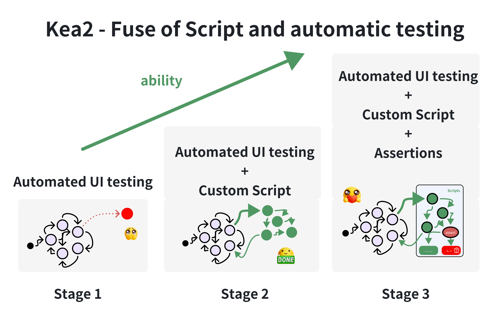

[](https://pypi.python.org/pypi/kea2-python)
[](https://pepy.tech/projects/kea2-python)


<div>
     
</div>

## 关于

Kea2 是一个易用的 Python 库，用于支持、自定义和改进移动应用的自动化 UI 测试。Kea2 的创新之处在于能够融合由人类编写的脚本与自动化 UI 测试工具，从而实现许多有趣且强大的功能。

Kea2 目前基于 [Fastbot](https://github.com/bytedance/Fastbot_Android) 和 [uiautomator2](https://github.com/openatx/uiautomator2) 构建，目标平台为 [Android](https://en.wikipedia.org/wiki/Android_(operating_system)) 应用。

## 主要特性
- **特性 1** (查找稳定性问题)：具备 [Fastbot](https://github.com/bytedance/Fastbot_Android) 的全部能力，用于压力测试和发现*稳定性问题*（即*崩溃缺陷*）；

- **特性 2** (自定义测试场景\事件序列\黑白名单\黑白控件[^1])：在运行 Fastbot 时自定义测试场景（例如测试特定应用功能、执行特定事件序列、进入特定 UI 页面、达到特定应用状态、黑名单特定活动/UI 控件/UI 区域），由 *python* 语言和 [uiautomator2](https://github.com/openatx/uiautomator2) 赋能，具备完全能力和灵活性；

- **特性 3** (支持断言机制[^2])：支持在运行 Fastbot 时自动断言，基于继承自 [Kea](https://github.com/ecnusse/Kea) 的[基于性质的测试](https://en.wikipedia.org/wiki/Software_testing#Property_testing)思想，发现*逻辑缺陷*（即*非崩溃缺陷*）。

**Kea2 三大特性的能力对比表**
|  | **特性 1** | **特性 2** | **特性 3** |
| --- | --- | --- | ---- |
| **发现崩溃缺陷** | :+1: | :+1: | :+1: |
| **在深层状态发现崩溃缺陷** |  | :+1: | :+1: |
| **发现非崩溃的功能（逻辑）缺陷** |  |  | :+1: |

<div align="center">
    <div style="max-width:80%; max-height:80%">
     
    </div>
</div>

## 设计与发展路线
作为一个 Python 库，Kea2 目前集成：
- [unittest](https://docs.python.org/3/library/unittest.html) 作为测试框架；
- [uiautomator2](https://github.com/openatx/uiautomator2) 作为 UI 测试驱动；
- [Fastbot](https://github.com/bytedance/Fastbot_Android) 作为后台自动化 UI 测试工具。

未来，Kea2 将扩展支持：
- [pytest](https://docs.pytest.org/en/stable/)
- [Appium](https://github.com/appium/appium)、[Hypium](https://developer.huawei.com/consumer/cn/doc/harmonyos-guides/hypium-python-guidelines)（针对 HarmonyOS/Open Harmony）
- 其他自动化 UI 测试工具（不限于 Fastbot）

## 安装

运行环境要求：
- 支持 Windows、MacOS 和 Linux
- python 3.8+，Android 4.4+（已安装 Android SDK）
- **VPN 关闭**（特性 2 和 3 需要）

通过 `pip` 安装 Kea2：
```bash
python3 -m pip install kea2-python
```

通过运行以下命令查看 Kea2 的选项 
```bash
kea2 -h
```

## 快速测试

Kea2 连接并运行于 Android 设备。建议您进行快速测试以确保 Kea2 与您的设备兼容。

1. 连接真实 Android 设备或 Android 模拟器（一个设备即可），并通过运行 `adb devices` 确认设备已连接。

2. 运行 `quicktest.py` 测试示例应用 `omninotes`（该示例应用以 `omninotes.apk` 形式发布在 Kea2 的仓库中）。`quicktest.py` 脚本会自动安装并短暂测试该示例应用。

在您喜欢的工作目录下初始化 Kea2：
```python
kea2 init
```

> 若是您第一次运行 Kea2，此步骤始终需要。

运行快速测试：
```python
python3 quicktest.py
```

如果您看到应用 `omninotes` 成功运行和测试，说明 Kea2 工作正常！
否则，请帮助我们[提交问题反馈](https://github.com/ecnusse/Kea2/issues)，并附上错误信息。感谢！


## 特性 1（运行基础版 Fastbot：查找稳定性错误）

使用 Fastbot 的全部能力测试您的应用，进行压力测试并发现*稳定性问题*（即*崩溃缺陷*）；


```bash
kea2 run -s "emulator-5554" -p it.feio.android.omninotes.alpha --agent native --running-minutes 10 --throttle 200
```

理解上述选项含义请查看[文档](docs/manual_en.md#launching-kea2)

> 用法类似于原始 Fastbot 的[shell 命令](https://github.com/bytedance/Fastbot_Android?tab=readme-ov-file#run-fastbot-with-shell-command)。

查看更多选项通过
```bash
kea2 run -h
```

## 特性 2（运行增强版 Fastbot：自定义测试场景\事件序列\黑白控件）

在使用 Fastbot 等自动化 UI 测试工具测试应用时，您可能会发现部分特定 UI 页面或功能难以触达或覆盖。原因在于 Fastbot 缺乏对您的应用的知识。幸运的是，脚本测试擅长此类问题。在特性 2 中，Kea2 支持编写小脚本来引导 Fastbot 探索我们想去的任何位置。您也可以使用此类小脚本在 UI 测试过程中屏蔽特定控件。

在 Kea2 中，一个脚本包含两个要素：
- **前置条件:** 何时执行该脚本。
- **交互场景:** 交互逻辑（在脚本测试方法中指定）以达到目标位置。

### 简单示例

假设 `Privacy` 页面在自动化 UI 测试中难以触达。Kea2 能轻松引导 Fastbot 到达该页面。

```python
    @prob(0.5)
    # precondition: 当我们位于页面 `Home`
    @precondition(lambda self: 
        self.d(text="Home").exists
    )
    def test_goToPrivacy(self):
        """
        通过打开 `Drawer`、点击选项 `Setting`，然后点击 `Privacy`，
        引导 Fastbot 到达页面 `Privacy`。
        """
        self.d(description="Drawer").click()
        self.d(text="Settings").click()
        self.d(text="Privacy").click()
```

- 使用装饰器 `@precondition` 指定前置条件——当我们位于 `Home` 页面。
此时，`Home` 页面是 `Privacy` 页面的入口页面，且 Fastbot 易于触达 `Home` 页面。因此，脚本仅在检测到唯一控件 `Home` 存在时被激活。
- 在脚本的测试方法 `test_goToPrivacy` 中指定交互逻辑（即打开 `Drawer`、点击 `Setting` 和 `Privacy`）以引导 Fastbot 到达 `Privacy` 页面。
- 使用装饰器 `@prob` 指定在 `Home` 页面时做该引导的概率（本例为 50%）。这样，Kea2 仍允许 Fastbot 探索其他页面。

您可以在脚本 `quicktest.py` 中找到完整示例，并用以下命令搭配 Fastbot 运行该脚本：

```bash
# 启动 Kea2 并加载单个脚本 quicktest.py。
kea2 run -s "emulator-5554" -p it.feio.android.omninotes.alpha --agent u2 --running-minutes 10 --throttle 200 --driver-name d unittest discover -p quicktest.py
```

## 特性 3（运行增强版 Fastbot：加入自动断言）

Kea2 支持在运行 Fastbot 时自动断言，以发现*逻辑缺陷*（即*非崩溃缺陷*）。为此，您可以在脚本中添加断言。当自动 UI 测试中断言失败，即发现可能的功能缺陷。

在特性 3 中，一个脚本由三部分组成：

- **前置条件:** 何时执行该脚本；
- **交互场景:** 交互逻辑（在脚本的测试方法中指定）；
- **断言:** 期望的应用表现。

### 示例

在社交媒体 App 中，消息发送是常见功能。在消息发送页面，`send` 按钮当输入框非空（即有消息内容）时应始终出现。

<div align="center" >
    <div >
        
    </div>
    <p>期望行为（上图）与缺陷行为（下图）。
<p/>
</div>

针对上述一直应满足的性质，我们可编写如下脚本验证功能正确性：当消息发送页面存在 `input_box` 控件时，输入任意非空字符串，并断言 `send_button` 应始终存在。


```python
    @precondition(
        lambda self: self.d(description="input_box").exists
    )
    def test_input_box(self):
        from hypothesis.strategies import text, ascii_letters
        random_str = text(alphabet=ascii_letters).example()
        self.d(description="input_box").set_text(random_str)
        assert self.d(description="send_button").exist

        # 还可以做更多断言，例如：输入的字符串应该出现在消息发送页面中
        assert self.d(text=random_str).exist
```
> 我们使用了 [hypothesis](https://github.com/HypothesisWorks/hypothesis) 生成随机文本。

您可以通过与特性 2 类似的命令行运行此示例。

## 更多文档

[更多文档](docs/manual_en.md)，内容包括：
- Kea2 案例教程（基于微信介绍）
- Kea2 脚本定义方法，支持的脚本装饰器（如 `@precondition`、`@prob`、`@max_tries`）
- Kea2 启动方式、命令行选项
- 查看/理解 Kea2 的运行结果（如界面截图、测试覆盖率、脚本执行情况）
- [如何黑白控件/区域](docs/blacklisting.md)

## Kea2 采用的开源项目

- [Fastbot](https://github.com/bytedance/Fastbot_Android)
- [uiautomator2](https://github.com/openatx/uiautomator2)
- [hypothesis](https://github.com/HypothesisWorks/hypothesis)

## 相关论文

> General and Practical Property-based Testing for Android Apps. ASE 2024. [pdf](https://dl.acm.org/doi/10.1145/3691620.3694986)

> An Empirical Study of Functional Bugs in Android Apps. ISSTA 2023. [pdf](https://dl.acm.org/doi/10.1145/3597926.3598138)

> Fastbot2: Reusable Automated Model-based GUI Testing for Android Enhanced by Reinforcement Learning. ASE 2022. [pdf](https://dl.acm.org/doi/10.1145/3551349.3559505)

> Guided, Stochastic Model-Based GUI Testing of Android Apps. ESEC/FSE 2017.  [pdf](https://dl.acm.org/doi/10.1145/3106237.3106298)

### 维护者/贡献者

Kea2 由 [ecnusse](https://github.com/ecnusse) 团队积极开发和维护：

- [Xixian Liang](https://xixianliang.github.io/resume/) ([@XixianLiang][])
- Bo Ma ([@majuzi123][])
- Chen Peng ([@Drifterpc][])
- [Ting Su](https://tingsu.github.io/) ([@tingsu][])

[@XixianLiang]: https://github.com/XixianLiang
[@majuzi123]: https://github.com/majuzi123
[@Drifterpc]: https://github.com/Drifterpc
[@tingsu]: https://github.com/tingsu

[Zhendong Su](https://people.inf.ethz.ch/suz/), [Yiheng Xiong](https://xyiheng.github.io/), [Xiangchen Shen](https://xiangchenshen.github.io/), [Mengqian Xu](https://mengqianx.github.io/)、[Haiying Sun](https://faculty.ecnu.edu.cn/_s43/shy/main.psp), [Jingling Sun](https://jinglingsun.github.io/), [Jue Wang](https://cv.juewang.info/) 等也积极参与项目并贡献良多！

此外，Kea2 还获得了来自字节跳动（[Zhao Zhang](https://github.com/zhangzhao4444)、Fastbot 团队的 Yuhui Su）、OPay（Tiesong Liu）、微信（Haochuan Lu、Yuetang Deng）、华为、小米等多个工业界人士的宝贵见解、建议、反馈和经验分享，特此致谢！

[^1]: 许多 UI 自动化测试工具提供了“自定义事件序列”能力（如 [Fastbot](https://github.com/bytedance/Fastbot_Android/blob/main/handbook-cn.md#%E8%87%AA%E5%AE%9A%E4%B9%89%E4%BA%8B%E4%BB%B6%E5%BA%8F%E5%88%97) 和 [AppCrawler](https://github.com/seveniruby/AppCrawler)），但实际使用中存在诸多问题，如自定义能力有限、使用不灵活等。此前不少 Fastbot 用户抱怨“自定义事件序列”使用中遇到的问题，如[#209](https://github.com/bytedance/Fastbot_Android/issues/209)、[#225](https://github.com/bytedance/Fastbot_Android/issues/225)、[#286](https://github.com/bytedance/Fastbot_Android/issues/286)等。

[^2]: UI 自动化测试过程中支持自动断言是一项非常重要的能力，但几乎无测试工具提供此功能。我们注意到 [AppCrawler](https://ceshiren.com/t/topic/15801/5) 的开发者曾尝试提供断言机制，获得用户热烈响应，许多用户自2021年起不断催促，然未能实现。